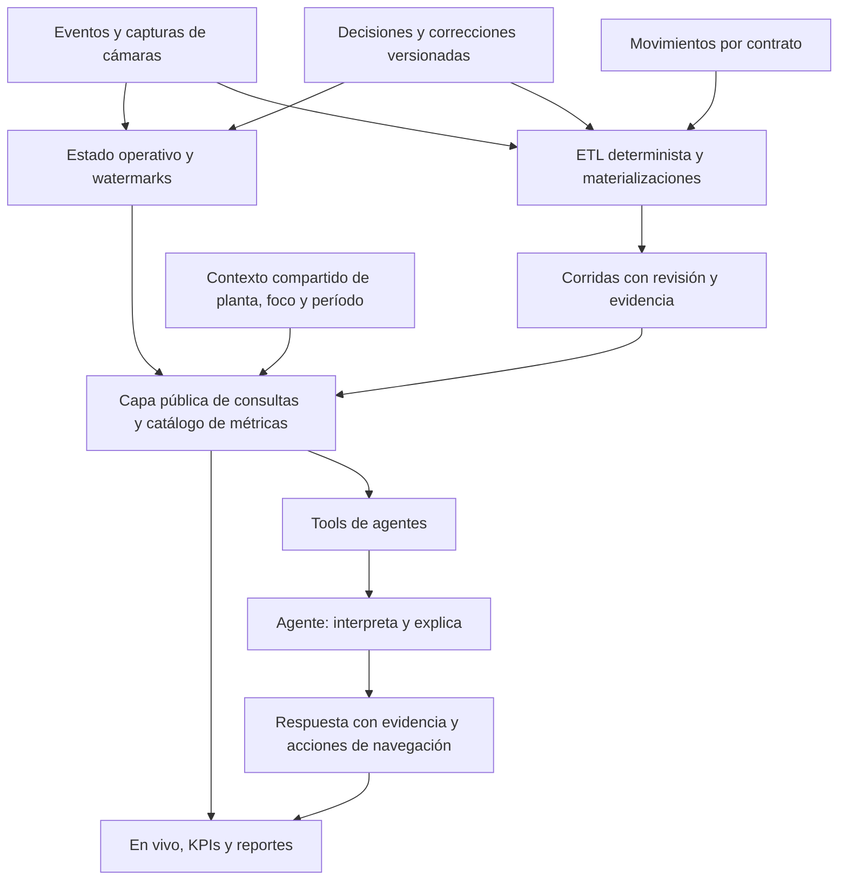

# Prueba funcional y propuesta transversal: En vivo, KPIs y agentes

Fecha: 7 de octubre de 2026. Prueba sobre la aplicación local y el código del workspace. Este informe registra resultados y propone integración; no acredita que las fallas encontradas estén corregidas.

## 1. Resultado principal

La supervisión operativa y el almacenamiento de corridas tienen una base funcional. La integración analítica está incompleta: la pantalla, el caché y el agente no comparten todavía un contrato único de contexto y métricas.

Los tres problemas más urgentes son:

1. **NVAi no responde en esta instalación:** la consulta real devolvió `Claude Code no encontrado (claude.exe)`, aunque `/agent/status` devuelve `configured: true`.
2. **El agente recibe la planta equivocada:** con San Lorenzo visible, el panel muestra `ricardone · ahora`. El shell fija esa planta y no transmite el camión, punto, período o indicador seleccionado.
3. **El KPI de tiempos pierde datos al hidratar una corrida:** el disco contiene tramos y agregados, pero la pantalla afirma que no existen. El cargador interpreta un resumen como si fuera el índice completo.

Recomiendo conservar los cálculos deterministas del sistema y convertirlos en recursos consultables tanto por las pantallas como por los agentes. El agente interpreta, compara y explica resultados con evidencia; los conteos, percentiles y filtros de negocio deben resolverse en esa capa compartida.

## 2. Qué se probó y con qué límites

- Recorrido en Chrome mediante la extensión: selección de zona, detalle por punto, histórico, cámaras, foto, navegación de KPIs, selección de período y consulta NVAi.
- Lecturas de API: estado de ambas plantas, disponibilidad de corridas, resolución de ventana, tablas, resumen y estado del agente.
- **85 pruebas Vitest aprobadas**, en 10 archivos del workspace principal. Cubren reductor, estados, candidatos, evidencia, predecesores, caché paginado, ventanas, niveles C/D/E y composición histórica.
- **5 pruebas Node aprobadas** de decisiones y archivo: idempotencia, conflicto de versión, motivo obligatorio, reserva de caso, reapertura y persistencia. Son independientes de las 85 anteriores.
- Control de arquitectura y compilación TypeScript. Ambos fallan; se detallan abajo.
- Build Vite, con resultado en el log adjunto.

La primera ejecución Vitest también descubrió copias en `.claude/worktrees`; sus resultados no se suman. La ejecución definitiva excluye esas carpetas. El log inicial de Node incluye archivos que usan otro runner: para evitar inflar el resultado, se cuentan únicamente las cinco pruebas del log específico de decisiones.

No confirmé, descarté, reubiqué ni vinculé camiones reales para esta prueba. No forcé corridas ETL. Las escrituras de decisiones se prueban con fixtures de los tests. No se simuló caída de infraestructura ni carga con múltiples operadores reales. La ausencia del ejecutable impidió validar respuestas analíticas completas del agente.

## 3. Matriz de resultados observados

| Prueba | Estado | Evidencia e interpretación |
|---|---|---|
| Estado de Ricardone y San Lorenzo | OK | HTTP 200, sitio correcto y suma de presencia por sector consistente con total de planta en ambos snapshots. Valida estructura e invariante, no exactitud física del conteo. |
| Seleccionar Playa OSL | OK | Filtra el listado por esa zona de San Lorenzo y muestra ausencia de coincidencias. No cambia a una zona de Ricardone. |
| Abrir un punto del plano | OK | Abre detalle con planta, punto, actividad y acceso a sus cámaras. |
| Histórico del punto | OK con cobertura parcial | Descarga/volcable muestra datos desde corridas y advierte que faltan el 5 y 6 de octubre en la ventana consultada. |
| Cámara frontal de ingreso Ricardone | OK en la muestra | Imagen visible en el reproductor. No equivale a certificar disponibilidad de todas las cámaras. |
| Cámara trasera del mismo grupo | No disponible | La interfaz localiza el fallo y conserva la frontal; ofrece reintento. Falta verificar catálogo, canal y fuente. |
| Foto de captura | OK en la muestra | La consulta muestra escena y recorte. La clasificación del DSS se debe tratar como evidencia automática, no como certeza de tipo de vehículo. |
| Escape sobre reproductor | OK en la muestra | Cierra el visor y mantiene el detalle del punto. |
| KPIs sin período seleccionado | OK | Informa falta de contexto y ofrece cambiar período. |
| KPI de tiempos con corrida cargada | FALLA | Período marcado Listo y mensaje de ausencia de tramos, pese a tablas no vacías. |
| Fuente/fechas en preparación de datos | FALLA de presentación | Se observó Excel `138/8` días y estado «requiere preparación» junto a un período ya visible. Numerador y denominador pertenecen a alcances distintos. |
| Identificaciones y archivo | OK en tests | Persistencia, reapertura y controles de decisión pasan; no se ejercitaron escrituras operativas reales. |
| NVAi disponible | FALLA | Estado técnico positivo, ejecución real falla por ejecutable ausente. |
| Contexto de NVAi | FALLA | San Lorenzo visible, contexto `ricardone · ahora`; foco y período no llegan desde la pantalla. |
| Datos de corridas | OK de acceso | Resolución, resumen y tablas responden. No demuestra que todos los indicadores de todos los períodos sean utilizables. |
| Control arquitectónico | FALLA | `PointHistoryModal.tsx` importa internals de `etlWorkbench` fuera de la línea base permitida. |
| TypeScript global | FALLA | 191 diagnósticos `error TS` en la ejecución guardada. El bundle no reemplaza esta verificación. |

## 4. Fallas y mejoras, en orden de prioridad

### T01 · P0 — Disponibilidad real del agente

El endpoint de estado indica configuración, pero la consulta no puede iniciar el runtime. El usuario descubre la indisponibilidad después de escribir.

**Corregir:** separar `configured`, `runtimeAvailable`, `authenticated` y `toolsAvailable`; comprobar disponibilidad real y mostrar una causa accionable. Centralizar un adaptador del runtime que use efectivamente el entorno elegido para operar. El estado debe indicar qué se comprobó y cuándo; no afirmar login o acceso a herramientas por la sola existencia de `.mcp.json`.

**Aceptación:** si falta el runtime, se informa antes de enviar. Si está disponible, una consulta real devuelve hechos con fuente. No se implementó una instalación o cambio de proveedor durante esta prueba.

### T02 · P0 — Contexto global compartido

`AppShell` renderiza `<NvaiBubble site="ricardone" />`. `LiveMonitorPage` tiene su propia selección local. `NvaiFocus` contempla sector/patente, pero el shell no la alimenta. El chat ETL envía mensaje e historial, sin el contexto tipado de la vista.

**Corregir:** crear un contexto compartido que incluya planta(s), punto/zona, patente/journey, indicador, producto, circuito, turno, período y revisión. Cada pregunta conserva una copia del contexto usado. Una respuesta vieja mantiene su alcance aunque el operador cambie de planta.

**Aceptación:** desde San Lorenzo, «¿cómo está acá?» consulta San Lorenzo. Desde un gráfico filtrado, «explicame este pico» transmite su indicador, filtros y evidencia. Pedir «Ricardone» explícitamente puede cambiar el alcance de la pregunta y debe quedar visible.

### T03 · P0 — Contrato de hidratación de KPI roto

Corrida de prueba: `2026-09-28_2026-10-04`, `rulesVersion=etl_transform_v17`, marcada `stale=false`.

La API devuelve **4 filas** en `E_kpi_circuito`, **458 filas** en `E_kpi_operacion`, **25 filas** en `segment_timing_kpi` y **3.308 filas** en `segment_timing_legs`. Son cantidades de filas técnicas, no un conteo certificado de camiones o movimientos.

El runner guarda `stats.segmentTiming` reducido a `journeyCount`, `legCount` y `aggregateCount`. `loadTransformOutputFromRun` copia esas estadísticas y las convierte por casting al tipo completo. La pantalla espera `circuitCodes`, `aggregates` y otros datos del índice. Por eso presenta «sin tramos» sin distinguir ausencia de datos de incompatibilidad del resultado.

**Corregir:** hidratar el índice desde las tablas persistidas con un contrato validado, o entregar un DTO analítico completo desde un servicio. Evitar pedir reprocesamiento para reparar un problema de lectura. La ruta exacta de una semana y la composición de varias semanas deben devolver el mismo contrato.

**Aceptación:** la corrida guardada abre sus gráficos sin nueva corrida. Un resultado de esquema incompatible muestra error de contrato; cero filas válidas muestra ausencia de observaciones.

### T04 · P1 — Correcciones presentes, invalidación incompleta

La conexión ya existe: el runner headless y el Transform del cliente leen `/live/corrections`, y el pipeline aplica esas correcciones antes del análisis. Este avance debe preservarse.

La vigencia del caché se compara principalmente contra `rulesVersion`. El hash del runner usa rutas de eventos, cantidad de filas de movimientos y fechas; no incluye el contenido completo ni una revisión de correcciones. Una patente corregida o un archivo reemplazado manteniendo ruta y cantidad puede dejar una corrida aparentemente vigente.

Además, si la lectura de correcciones falla, se permite procesar sin ellas. Esa degradación debe quedar explícita y verificable en el resultado.

**Corregir:** revisión de correcciones, revisiones de fuentes/registro y esquema en la identidad de materialización. Marcar ventanas afectadas como desactualizadas; programar o permitir recalcularlas sin perder el resultado anterior. Guardar el conjunto de correcciones usado. No actualizar en silencio cifras históricas ya citadas.

**Aceptación:** corregir un evento de una semana cambia la revisión pendiente de esa semana, aunque no cambie la versión de reglas. El informe anterior sigue reconstruible.

### T05 · P1 — Catálogo de métricas y reglas contradictorias

Las instrucciones del repo dadas al analista citan tablas anteriores; `RUNS_TABLAS_CANONICAS.md` está marcado como supersedido; el prompt del chat prohíbe esas tablas y dirige a C/D/E. A su vez, el KPI de tiempos de la UI consulta índices y tablas de tramos que ese prompt limita. Las reglas no alcanzan para responder de forma idéntica a la pantalla.

**Corregir:** acordar un catálogo versionado por métrica y migrar conjuntamente documentación, instrucciones, UI y tools. Separar reglas de clasificación, versión del esquema y versión de métrica: `v14` del modelo documental no es necesariamente `etl_transform_v17` del pipeline.

El catálogo debe distinguir movimientos con evidencia, movimientos sin evidencia, journeys, visitas y patentes distintas. Una patente que vuelve varias veces no es una sola operación. Si se necesita un total combinado, su universo y deduplicación deben estar definidos y probados antes de publicarlo.

**Aceptación:** dada la misma métrica y alcance, agente y tarjeta consultan la misma definición, población y revisión. Las tablas de drill-down pueden usarse para explicar, con una ruta explícita en el catálogo.

### T06 · P1 — La integración histórica rompe una frontera arquitectónica

El modal del punto reutiliza gráficos y composición, lo cual evita empezar de cero, pero importa internals del workbench y falla el control arquitectónico. También descarga todas las tablas de cada corrida, aunque solo necesite una actividad por punto.

**Corregir:** exponer una fachada de consulta pública por métrica/punto/período. Preferir un servicio que filtre y agregue antes de responder. Mantener el componente gráfico como presentador. No ampliar la excepción arquitectónica para ocultar el acoplamiento.

**Aceptación:** el control de arquitectura pasa y abrir un punto consulta solo sus recursos necesarios.

### T07 · P1 — Ventanas incompletas y baseline

El histórico mostró correctamente días faltantes. En la lista técnica había 46 ventanas y 43 marcadas desactualizadas según las reglas actuales. Es una foto del caché en esta sesión; no significa que esos datos sean incorrectos físicamente ni que deban reprocesarse todos de inmediato.

**Corregir:** resolver cobertura exacta y vigencia para cada consulta. Mostrar días solicitados, cubiertos y faltantes; distinguir «sin corrida», «sin tabla», «sin observaciones» y «resultado desactualizado». Comparar operación actual con un baseline compatible en punto, tramo, producto, turno y población.

Un camión todavía abierto tiene una permanencia transcurrida; un P90 de visitas cerradas tiene otra población. Su comparación es una señal operacional, no un diagnóstico causal automático.

### T08 · P1 — Cobertura de fuentes usa denominadores diferentes

`SourceCoverageCards` cuenta todos los días del backup Excel para el numerador, pero usa los días de la inspección como denominador. El contexto técnico puede incluir días auxiliares de reconstrucción.

**Corregir:** calcular disponibilidad dentro del rango solicitado y presentar por separado días auxiliares. Unificar estado de inspección y corrida activa para evitar «Listo» y «requiere preparación» sin explicar sus distintos alcances.

**Aceptación:** el numerador nunca supera el denominador y cada tarjeta declara el rango que evalúa.

### T09 · P1 — Calidad, evidencia y salud del reproductor

La cámara frontal funcionó; la trasera no estaba disponible. El mensaje es claro, pero abrir el reproductor no certifica frames recientes. «Capturas hoy» en el modal se obtiene de una cola limitada de capturas recientes de toda la planta: puede dejar de representar el día completo cuando aumenta el volumen. El texto actual aclara esa limitación, pero el título sigue favoreciendo una lectura de total diario.

**Corregir:** fuente agregada de día/turno independiente del buffer de evidencias, más watermark de eventos y salud de reproducción. Etiquetar como muestra reciente mientras no exista cobertura completa. Patentes distintas de OCR no deben presentarse sin matices como camiones físicos distintos.

### T10 · P1 — Publicación y validación técnica

Pasar tests de módulos no certifica el producto completo. TypeScript global falla y el control de arquitectura también. El caso de KPI demuestra que el recorrido «guardar → cargar → renderizar» necesita tests propios.

**Corregir:** agregar pruebas de contrato sobre una corrida realista persistida, sin depender del índice vivo del cliente. Separar disponibilidad del runtime, paridad analítica y presentación. Resolver la deuda global de compilación en un trabajo acotado; no atribuir los 191 diagnósticos al rediseño sin un baseline comparativo.

## 5. Arquitectura transversal propuesta

### 5.1 Tres tiempos de datos

| Modalidad | Fuente | Uso | Cómo se presenta |
|---|---|---|---|
| Ahora | Estado operacional versionado | Presencia, espera transcurrida, flujo reciente, pendientes | Hora de corte, último evento y limitaciones de inferencia |
| Hoy/turno provisional | Agregados incrementales, población definida | Actividad del día y comparación inicial | Provisional; sin exigir una corrida semanal completa |
| Histórico consolidado | Corridas materializadas | Circuitos, productos, tiempos cerrados, comité | Período, cobertura, reglas, revisión y procedencia |

Esto permite actuar ahora y consultar historia sin confundir ambos estados. La capa común enruta la consulta al recurso adecuado; no obliga a que toda información pase por una corrida pesada.

### 5.2 Una definición de métrica, varios consumidores

Para cada indicador registrar: identificador, descripción operativa, unidad, grano, población incluida/excluida, fuente, fórmula, dimensiones válidas, definición temporal, calidad mínima, versión y drill-down.

Ejemplos de identificadores propuestos: `plant.trucks_present`, `point.arrivals_last_60m`, `journey.duration_p90`, `segment.duration_median`, `identification.pending_cases`. No son endpoints implementados.

Una misma palabra como «espera» debe distinguir tiempo transcurrido de un camión abierto, duración observada de una operación cerrada y estimación de drenaje de una zona.

### 5.3 Contrato de consulta y respuesta

Consulta mínima: `metricId`, modo temporal, planta(s), foco, rango solicitado, zona horaria, filtros y política de revisión. La aplicación puede agregar el punto del gráfico seleccionado y referencias de filas visibles.

Respuesta mínima:

- Valor, unidad, población y cantidad de observaciones utilizadas.
- Ventana solicitada y ventana efectivamente cubierta; faltantes y restricciones.
- `metricVersion`, `schemaVersion`, `rulesVersion` y revisión de correcciones.
- `runIds` y sus revisiones, o snapshot/watermark para datos actuales.
- Calidad y fuentes temporales usadas: cámara, combinación o respaldo Excel.
- `evidenceId` estable y enlace a operaciones/lecturas que explican el resultado.

Un período estable debe poder tener varias revisiones. El `runId` de ventana actual se sobrescribe al reprocesar: hace falta un identificador de materialización para conservar lo que vio un comité o citó un agente.

### 5.4 Tools y experiencia del agente

Exponer herramientas públicas como `get_metric`, `compare_metric`, `get_entity_evidence`, `get_live_state` y `resolve_analysis_context`. Son nombres de diseño; las tools actuales deben adaptarse gradualmente, conservando su API cuando resulte útil.

La tool calcula el agregado con las reglas del catálogo. El agente selecciona consultas y explica resultados; no descarga miles de filas para contar patentes o calcular percentiles dentro de su razonamiento. Una consulta por tabla no garantiza una respuesta completa si existe paginación o requiere varias poblaciones.

En cada tarjeta o punto: **Analizar con NVAi**, **Ver evidencia** y **Comparar con período**. Esas acciones envían contexto tipado. La respuesta muestra «Analizando San Lorenzo · volcable · período X · revisión Y», con enlaces de vuelta al punto o gráfico.

Las propuestas de corrección se presentan como acciones preparadas. Una explicación analítica no confirma patentes ni modifica registros por sí sola.

### 5.5 Composición e invalidación

Para rangos de varias semanas, filtrar los hechos por fecha y población, deduplicar con llaves canónicas y recomputar los agregados. **No promediar medianas ni P90 semanales.** Si la pregunta pide un subrango, los resultados deben cubrir ese subrango o declarar el alcance disponible; no sustituirlo silenciosamente por semanas completas.

Cuando cambien lecturas, decisiones, fuentes o reglas: identificar ventanas afectadas → marcar nueva revisión necesaria → generar materialización → validar invariantes → publicarla. Conservar última revisión válida durante el proceso, etiquetada. Un fallo no debe publicar una corrida incompleta como vigente.

## 6. Plan recomendado

| Etapa | Entrega concreta | Puerta de salida |
|---|---|---|
| 1 | Reparar hidratación KPI, disponibilidad del runtime y contexto de planta | Corrida vigente abre gráficos; NVAi responde con planta correcta |
| 2 | Catálogo pequeño de métricas prioritarias y fachada pública | Tarjeta y tool devuelven el mismo resultado y evidencia para cinco métricas |
| 3 | Identidad de materialización, hashes y revisión de correcciones | Una corrección invalida solo ventanas afectadas; cita anterior reproducible |
| 4 | Consultas por punto, producto, circuito y período; composición en servicio | Igual alcance y filtros en En vivo, KPI, reporte y agente; arquitectura sin violaciones |
| 5 | Actividad del día/turno, baseline y análisis asistido contextual | Sin depender del buffer reciente ni confundir operación abierta con historia cerrada |

Empezaría por cinco métricas: presencia actual, ingresos últimos 60 minutos, mediana de duración por circuito, P90 de un tramo y casos pendientes de identificación. La ampliación a productos, transiles y comité sigue el mismo contrato; no necesita otro sistema de chat.

## 7. Tests que deben cerrar la integración

1. Corrida persistida con tramos → cargador → gráfico: mismo resultado que al terminar el pipeline.
2. Semana exacta y rango compuesto devuelven el mismo esquema analítico.
3. Pantalla San Lorenzo + pregunta contextual: planta correcta en request y respuesta.
4. Gráfico filtrado por circuito/producto/turno + agente: conserva todos los filtros.
5. Tarjeta, API/tool y reporte: igualdad de valor, unidad, población y revisión.
6. Subrango dentro de una semana: recorte exacto y cobertura explícita.
7. Dos semanas: mediana/P90 calculados sobre hechos elegibles, no sobre sus agregados.
8. Patente con varias visitas: se distingue vehículo, visita, journey y movimiento.
9. Corrección nueva con mismas reglas: caché afectado cambia de estado.
10. Fuente reemplazada con misma ruta y cantidad de filas: revisión detectada.
11. Reproceso del mismo run: evidencia anterior sigue accesible por materialización.
12. Datos parciales: faltantes visibles en gráfico, respuesta y exportación.
13. Fuente de correcciones no disponible: resultado bloqueado o degradación declarada.
14. Runtime ausente o sin acceso a tools: health check coincide con consulta real.
15. Buffer de capturas saturado: indicador diario no cambia por pérdida de muestra.
16. Paginación sobre una revisión cambiada: no mezcla filas aunque conserve total y headers.
17. Cambiar planta durante una respuesta: la respuesta conserva y muestra su contexto original.
18. Contrato de métrica incompatible: mensaje de incompatibilidad, no «sin datos».

Estas son pruebas propuestas, no resultados ya aprobados. Las 90 pruebas ejecutadas no cubren todavía toda esta matriz.

## 8. Evidencias y fuentes

### Resultados guardados

- [85 tests de integración](test-integracion.log).
- [5 tests de decisiones](test-decisiones.log).
- [Diagnósticos TypeScript](typescript.log).
- [Build Vite](vite-build.log).
- [Estado de API y configuración del agente](api-checks.json).
- [Resolución de corrida vigente y tablas](run-checks.json).
- [Contrato de KPI y filas disponibles](kpi-contract-check.json).
- [NVAi: runtime ausente](01-nvai-error.png).
- [Histórico de punto con cobertura parcial](02-historico-punto.png).
- [KPI sin contexto](03-kpi-sin-contexto.png).
- [Disponibilidad con denominadores distintos](04-disponibilidad.png).
- [KPI con datos persistidos que no aparecen](05-kpi-datos-no-visibles.png).
- [Cámara frontal visible y trasera no disponible](06-camaras-parcial.png).

`api-checks.json` contiene una primera muestra tomada del orden de `/windows`; su campo `latest` no representa la fecha más reciente. Para la selección válida del análisis se usa `run-checks.json`, que ordena por fecha y elige la más reciente vigente. No se usa la muestra inicial como resultado de negocio.

### Implementación consultada

| Fuente | Función en el análisis |
|---|---|
| [LiveMonitorPage](../../src/pages/LiveMonitorPage.tsx), [PointHistoryModal](../../src/components/plant/PointHistoryModal.tsx) | Supervisión y puente a histórico |
| [AppShell](../../src/app/AppShell.tsx), [NvaiPanel](../../src/components/nvai/NvaiPanel.tsx), [API NVAi](../../src/components/nvai/nvaiApi.ts) | Contexto de agente y envío de preguntas |
| [NVAi server](../../server/plantState/nvai.mjs), [chat ETL](../../server/etl-agent-chat.mjs) | Snapshot, reglas, catálogo permitido y runtime |
| [Server local](../../server/truckflow-local-server.mjs) | API, disponibilidad, ventanas y criterio de stale |
| [Runner headless](../../scripts/run-etl-headless.ts) | Estadísticas persistidas, hash y correcciones |
| [Cargador desde disco](../../src/features/real-truckflow/etlWorkbench/etlTransformOutputFromDisk.ts), [composición](../../src/features/real-truckflow/etlWorkbench/etlComposeRuns.ts) | Contratos exactos y multiventana |
| [KPI de tiempos](../../src/features/real-truckflow/tabs/KpiTiemposTab.tsx), [Workbench](../../src/features/real-truckflow/etlWorkbench/EtlWorkbenchContext.tsx) | Consumo del índice y contexto histórico |
| [Cobertura de fuentes](../../src/features/real-truckflow/dataPreparation/SourceCoverageCards.tsx) | Denominadores de disponibilidad |
| [Modelo C/D/E](../NIVELES_ABCD.md), [tablas anteriores](../RUNS_TABLAS_CANONICAS.md), [runbook agentes](../../agentes/README.md) | Contradicciones documentales y reglas por consolidar |

Los resultados corresponden a esta sesión de prueba. El workspace tiene trabajo en curso; antes de implementar se deben conservar los cambios de los demás y fijar una revisión para validar paridad de forma reproducible.
